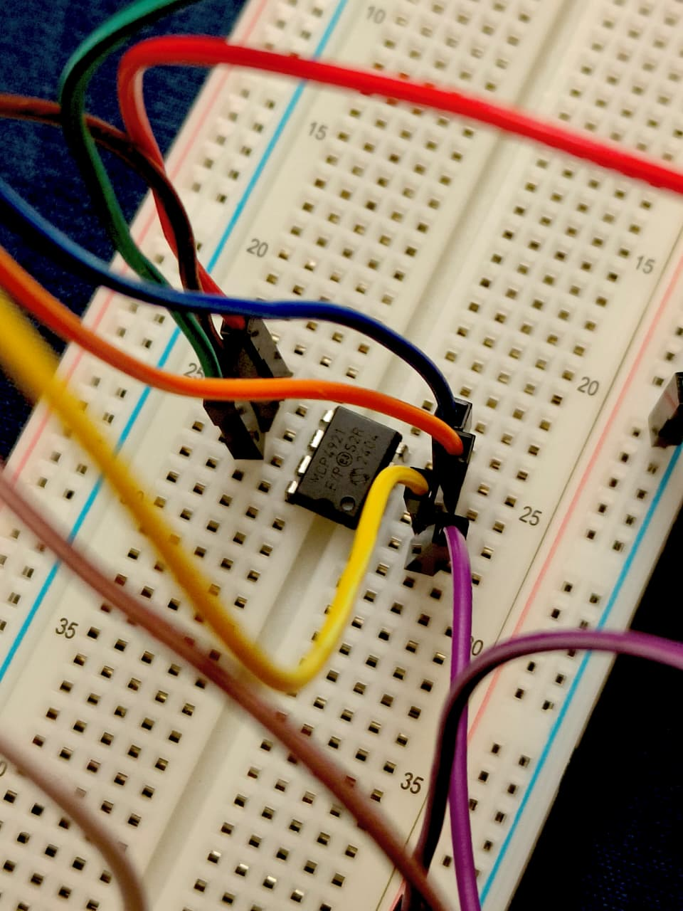

\# MCP4921 Random Wave using STM32 Nucleo-F103RB

This project generates a \*\*random analog waveform\*\* using the MCP4921 12-bit SPI DAC.

---

\## 🧩 Description

\- STM32 uses `rand()` to generate random 12-bit values.

\- MCP4921 outputs a random voltage between \*\*0 V and 3.3 V\*\*.

\- Delay = \*\*500 ms\*\* between updates (adjust for faster/slower random jumps).

---

## ⚡ Circuit Connections (Common for All)

| MCP4921 Pin | STM32 Pin | Description |
|--------------|------------|-------------|
| **VDD (1)** | 3.3 V | Power |
| **CS̅ (2)** | PA4 | Chip Select |
| **SCK (3)** | PA5 | SPI Clock |
| **SDI (4)** | PA7 | SPI MOSI |
| **LDAC̅ (5)** | GND | Latch (always enabled) |
| **VREF (6)** | 3.3 V | Reference voltage |
| **VSS (7)** | GND | Ground |
| **VOUT (8)** | Output | Connect to multimeter or oscilloscope |

---

\## 🧮 Formula

\\\[

V\_{out} = \\frac{D}{4096} \\times V\_{REF}

\\]

## 🖼️ Hardware Setup

### Full Setup

### Close-up of MCP4921 Wiring

\## 📈 Expected Output

A randomly fluctuating voltage output between \*\*0 V and 3.3 V\*\*.  

When observed on an oscilloscope, it appears as a random waveform resembling electronic noise.

